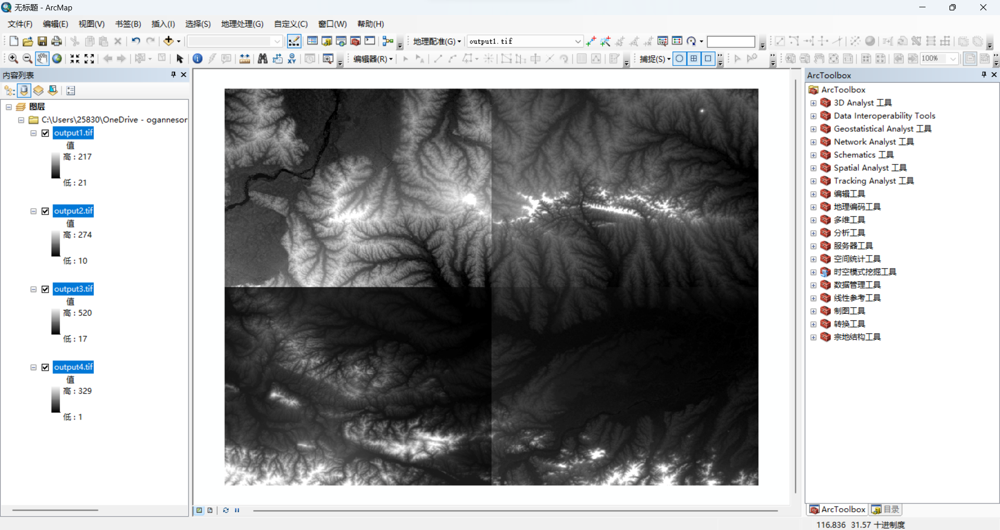

# Tif 四等分
***
>目的：将已有的 tif 图像四等分，生成四个 tif 图像
## 1. 读取 tif 图像
```python
import numpy as np
from osgeo import gdal

# 读数据
filename = r"C:\Users\25830\OneDrive - oganneson\桌面\学习\python学习\python_learning\GIS\dem_fengle.tif"
ds = gdal.Open(filename)
band = ds.GetRasterBand(1)
data = band.ReadAsArray()
```
其中，**data**为**numpy**数组，**shape**为 (行数，列数)，**band**为**gdal**对象，**d**s 为**gdal**对象，**filename**为 tif 图像路径

## 2. 生成四个 tif 图像
```python
# 四等分
h = np.vsplit(data, 2)
s1 = np.hsplit(h[0], 2)
s2 = np.hsplit(h[1], 2)
```

## 3. 创建输出文件
```python
# 创建输出文件
driver = gdal.GetDriverByName("GTiff")
```

>若是将文件直接输出，会导致图像的坐标都沿用原图形的坐标，这样看起来四张图都是重叠在一起的，所以需要对图像进行重新赋值坐标

## 4. 新图形坐标转换
### 获取原图形坐标
```python
# 获取原始文件的地理坐标信息
x_origin, pixel_width, _, y_origin, _, pixel_height = ds.GetGeoTransform()
```

### 计算新图形的 x 和 y
```python
# 计算新的x_origin和y_origin的增量
delta_x = (data.shape[1] / 2) * pixel_width
delta_y = (data.shape[0] / 2) * abs(pixel_height)
```

### 图像输出
```python
# 循环遍历并保存四个部分
for i in range(2):
    for j in range(2):
        # 获取当前区块
        quarter = quarters[i][j]

        # 使用增量计算新的x_origin和y_origin
        new_x_origin = x_origin + j * delta_x
        new_y_origin = y_origin - i * delta_y

        # 新的仿射变换参数
        new_geotransform = (new_x_origin, pixel_width, 0, new_y_origin, 0, pixel_height)

        # 输出文件名
        output_file = r"C:\Users\25830\OneDrive - oganneson\桌面\学习\python学习\python_learning\GIS\output{}.tif".format(
            i * 2 + j + 1)

        # 创建新的数据集
        outds = driver.Create(output_file, quarter.shape[1], quarter.shape[0], 1, gdal.GDT_Float32)

        # 设置仿射变换参数
        outds.SetGeoTransform(new_geotransform)

        # 将数组数据写入栅格波段
        outds.GetRasterBand(1).WriteArray(quarter)

        # 刷新缓存以确保所有数据写入
        outds.FlushCache()
        outds = None
```

## 最后清理
```python
# 清理
ds = None
band = None
data = None
```

## 输出图像如下



