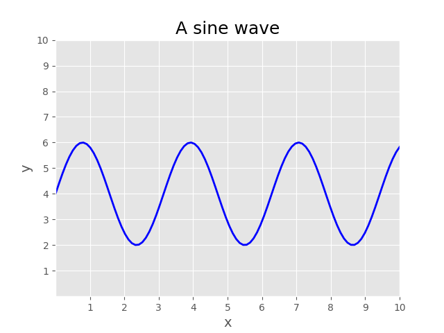

本次的内容主要使关于使用 matpoltlib 绘制图形的一些基础知识
# Matplotlib

## 调用库
```python
import matplotlib.pyplot as plt # 用于绘制图形
import numpy as np # 用于生成数据
```
## 绘制图形

```python
fig, ax = plt.subplots()# Create a figure containing a single axes. #创建一个画布
ax.plot([1, 2, 3, 4], [1, 4, 2, 3])# Plot some data on the axes. #画图
plt.show()# Display the figure. #显示图像
```
图像如下：


## 绘制多个图形

```python
fig = plt.figure()# an empty figure with no Axes #创建一个空的画布
fig,ax = plt.subplots()# a figure with a single Axes #创建一个画布
fig, axs = plt.subplots(2, 2)# a figure with a 2x2 grid of Axes #创建一个画布
plt.show()
```
图形如下，这样就生成了一个 2*2 的画布


## 图形风格设置
    
```python
import matplotlib.pyplot as plt
import numpy as np

plt.style.use('ggplot')  # 设置图形风格

# make data
x = np.linspace(0, 10, 100)
y = 4 + 2 * np.sin(2 * x)

# plot
fig, ax = plt.subplots()
ax.plot(x, y, 'b-', linewidth=2, label='sine wave')  # 画出曲线
ax.set_title('A sine wave', fontsize=18)  # 设置标题和字体大小
ax.set_xlabel('x', fontsize=14)  # 设置x轴标签和字体大小
ax.set_ylabel('y', fontsize=14)  # 设置y轴标签和字体大小
ax.set(xlim=(0, 10), xticks=np.arange(1, 11),
       ylim=(0, 10), yticks=np.arange(1, 11))  # 设置x轴和y轴的范围和刻度
plt.show()
```
图形如下：


## 散点图
```python
# 散点图
import matplotlib.pyplot as plt
import numpy as np

plt.style.use('_mpl-gallery')

# make data
np.random.seed()  # 随机数种子
x = 4 + np.random.normal(0, 2, 24)  # 均值为4，标准差为2，24个数据
y = 4 + np.random.normal(0, 2, len(x))  # 均值为4，标准差为2，24个数据
# size and color
size = np.random.uniform(15, 80, len(x))  # 均匀分布，15-80之间，24个数据
color = np.random.uniform(15, 80, len(x))  # 均匀分布，15-80之间，24个数据
# plot
fig, ax = plt.subplots()
ax.scatter(x, y, s=size, c=color, vmin=0, vmax=100)  # vmin,vmax为最大最小值
ax.set(xlim=(0, 8), xticks=np.arange(1, 8),
       ylim=(0, 8), yticks=np.arange(1, 8))  # 设置x,y轴的范围，以及刻度

plt.show()
```
图形如下：


关于代码中的随机数种子
