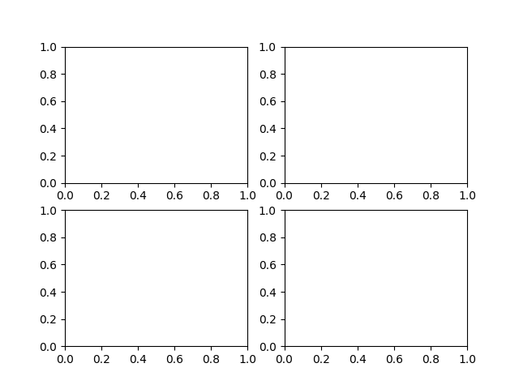

本次的内容主要使关于使用matpoltlib绘制图形的一些基础知识
# Matplotlib

## 调用库
```python
import matplotlib.pyplot as plt # 用于绘制图形
import numpy as np # 用于生成数据
```
## 绘制图形

```python
fig, ax = plt.subplots()# Create a figure containing a single axes. #创建一个画布
ax.plot([1, 2, 3, 4], [1, 4, 2, 3])# Plot some data on the axes. #画图
plt.show()# Display the figure. #显示图像
```
图像如下：

