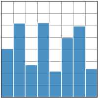

本次的内容主要使关于使用matpoltlib绘制图形的一些基础知识
# Matplotlib

## 调用库
```python
import matplotlib.pyplot as plt # 用于绘制图形
import numpy as np # 用于生成数据
```
## 绘制图形

```python
fig, ax = plt.subplots()# Create a figure containing a single axes. #创建一个画布
ax.plot([1, 2, 3, 4], [1, 4, 2, 3])# Plot some data on the axes. #画图
plt.show()# Display the figure. #显示图像
```
图像如下：


## 绘制多个图形

```python
fig = plt.figure()# an empty figure with no Axes #创建一个空的画布
fig,ax = plt.subplots()# a figure with a single Axes #创建一个画布
fig, axs = plt.subplots(2, 2)# a figure with a 2x2 grid of Axes #创建一个画布
plt.show()
```
图形如下，这样就生成了一个2*2的画布


## 图形风格设置
    
```python
import matplotlib.pyplot as plt
import numpy as np

plt.style.use('ggplot')  # 设置图形风格

# make data
x = np.linspace(0, 10, 100)
y = 4 + 2 * np.sin(2 * x)

# plot
fig, ax = plt.subplots()
ax.plot(x, y, 'b-', linewidth=2, label='sine wave')  # 画出曲线
ax.set_title('A sine wave', fontsize=18)  # 设置标题和字体大小
ax.set_xlabel('x', fontsize=14)  # 设置x轴标签和字体大小
ax.set_ylabel('y', fontsize=14)  # 设置y轴标签和字体大小
ax.set(xlim=(0, 10), xticks=np.arange(1, 11),
       ylim=(0, 10), yticks=np.arange(1, 11))  # 设置x轴和y轴的范围和刻度
plt.show()
```
图形如下：


在该网址可以查看自带的风格：
[matplotlib默认风格](https://matplotlib.org/stable/gallery/style_sheets/style_sheets_reference.html)

## 散点图
```python
# 散点图
import matplotlib.pyplot as plt
import numpy as np

plt.style.use('_mpl-gallery')

# make data
np.random.seed()  # 随机数种子
x = 4 + np.random.normal(0, 2, 24)  # 均值为4，标准差为2，24个数据
y = 4 + np.random.normal(0, 2, len(x))  # 均值为4，标准差为2，24个数据
# size and color
size = np.random.uniform(15, 80, len(x))  # 均匀分布，15-80之间，24个数据
color = np.random.uniform(15, 80, len(x))  # 均匀分布，15-80之间，24个数据
# plot
fig, ax = plt.subplots()
ax.scatter(x, y, s=size, c=color, vmin=0, vmax=100)  # vmin,vmax为最大最小值
ax.set(xlim=(0, 8), xticks=np.arange(1, 8),
       ylim=(0, 8), yticks=np.arange(1, 8))  # 设置x,y轴的范围，以及刻度

plt.show()
```
图形如下：


## 条形图
```python
# 条形图
# axes.bar(x, height, width=0.8, bottom=None, *, align='center', data=None, **kwargs)

import matplotlib.pyplot as plt
import numpy as np
plt.style.use('_mpl-gallery')

# make data
x = 0.5 +np.arange(8)#生成0.5-8的等差数列
y= np.random.uniform(2,7,len(x))#生成2-7之间的随机数，长度为x的长度 uniform均匀分布
# plot
fig, ax = plt.subplots()
ax.bar(x, y, width=1, align='center',edgecolor='white', alpha=0.8)#alpha透明度
# align对齐方式
ax.set(xlim=(0,8), xticks=np.arange(1,8),
         ylim=(0,8), yticks=np.arange(1,8))#设置x,y轴的范围，以及刻度
plt.show()
```

图形如下：


直方图函数：
```python
axes.bar(x, height, width=0.8, bottom=None, *, align='center', data=None, 
         **kwargs)
```

`axes.bar()`是matplotlib库的一个函数，用于在给定的轴上创建条形图。让我们详细了解下每个参数的作用：
- `x`: 这是一个数组，表示条形的 x 轴坐标。这可以是数字或者是一组类别。
- `height`: 这是一个数组，与x参数长度相同，表示每个条形的高度。
- `width`: 这是一个可选参数，默认值为 0.8。它表示每个条形的宽度。
- `bottom`: 这是一个可选参数，默认值为None。它是一个数组，用于定义每个条形的 y 轴坐标。
- `align`: 这是一个可选参数，默认值为 'center'。它决定了条形的对齐方式，可选的值有 'center' 和 'edge'。如果设置为 'center'，条形将以 x 位置为中心。如果设置为 'edge'，条形将以 x 位置为左边缘。
- `data`: 这是一个可选参数，默认值为None。如果提供了这个参数，那么其他的参数可以通过字符串来从这个数据对象中选择。
- `**kwargs`: 这是一种允许你传入任意数量的关键字参数的机制。在 `axes.bar()` 函数中，这些关键字参数可以被用来指定条形图的不同属性，比如颜色、标签、边缘颜色等。

## 直方图
```python
import matplotlib.pyplot as plt
import numpy as np
import time

plt.style.use('fast')

# make data
np.random.seed(int(time.time()))  # 以时间戳作为随机数种子
x = 4 + np.random.normal(0, 1.5, 200)  # 均值为4，标准差为1.5，200个数据

# plot
fig, ax = plt.subplots()
ax.hist(x, bins=8,linewidth=0.5, range=(0, 8), color='C0',edgecolor='C1',label='histogram')  # bins为柱形数目，range为数值范围，density为标准化，color为颜色，edgecolor为边缘颜色，label为标签
#若s设置density=True，则直方图下面的面积为1,也就是说，直方图的高度表示的是概率密度，而不是计数。
ax.set(xlim=(0, 8), xticks=np.arange(1, 8),
         ylim=(0, 56), yticks=np.linspace(0, 56, 9))  # 设置x,y轴的范围，以及刻度
ax.legend()  # 显示图例
plt.show()
```
图形如下：

```python
axes.hist(x, bins, range, density, weights, cumulative, bottom, histtype, align,orientation, rwidth, log, color, label, stacked, normed, hold, data, **kwargs)
```
`axes.hist()`
是matplotlib库的一个函数，用于在给定的轴上创建直方图。下面是每个参数的详细解释：

- `x`: 这是输入数组或者序列，表示需要计算并生成直方图的数据。
- `bins`: 这是一个可选参数，表示直方图的柱形数目。可以是一个整数或者一个序列。如果是一个序列，它定义了bin edges，包括右边界。如果未定义，则默认值为10。
- `range`:
  这是一个可选参数，表示需要计算直方图的数值范围。如果没有指定，range参数默认为(
  x.min(), x.max())。如果指定了bins为整数，range参数影响了bin的宽度。
- `density`: 这是一个可选参数，如果设置为True，则直方图将首先被标准化，然后再绘制，使得直方图下面的面积为1。
- `weights`: 这是一个可选参数，如果提供了这个参数，它必须和x参数的形状相同。这个参数可以用来为每个x值提供权重。
- `cumulative`: 这是一个可选参数，如果设置为True，那么直方图将是一个累积直方图。
- `bottom`: 这是一个可选参数，如果给出了，每个bin的底部位置就会被移到这个位置。默认为None。
- `histtype`: 这是一个可选参数，表示直方图的类型。可以是'bar', 'barstacked', '
  step', 'stepfilled'。
- `align`: 这是一个可选参数，表示bin的对齐方式，可以是'left', 'mid', 'right'。
- `orientation`: 这是一个可选参数，表示直方图的方向。可以是'horizontal', 'vertical'。
- `rwidth`: 这是一个可选参数，表示bar的相对宽度。
- `log`: 这是一个可选参数，如果设置为True，那么y轴将会以对数刻度来显示。
- `color`: 这是一个可选参数，表示直方图的颜色。
- `label`: 这是一个可选参数，表示用于直方图的标签。
- `stacked`: 这是一个可选参数，如果设置为True，那么多数据系列将会被堆叠在一起。默认为False。
- `normed`: 这是一个可选参数，现已被弃用，被`density`参数取代。
- `hold`: 这是一个可选参数，现已被弃用，用于控制是否在当前轴上重绘直方图。
- `data`: 这是一个可选参数，如果提供了这个参数，那么其他的参数可以通过字符串来从这个数据对象中选择。
- ` ** kwargs`: 这是一种允许你传入任意数量的关键字参数的机制。在`axes.hist()`
  函数中，这些关键字参数可以被用来指定直方图的不同属性，比如颜色、标签、边缘颜色等。


  

