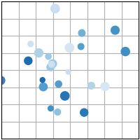
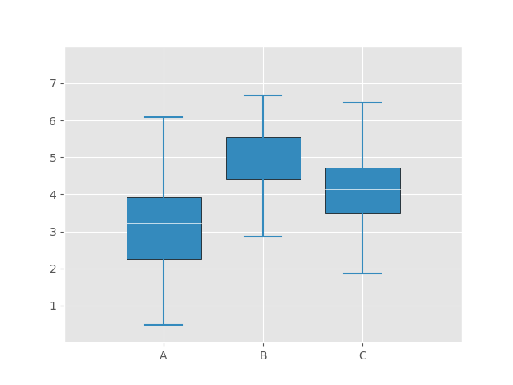
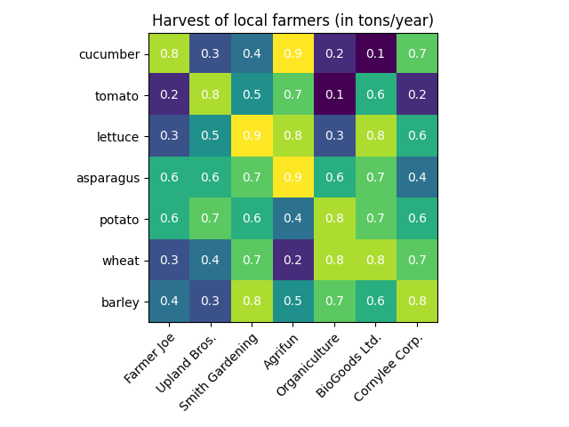

本次的内容主要使关于使用 matpoltlib 绘制图形的一些基础知识

# Matplotlib

`matplotlib` 是一个用于 Python 编程语言的绘图库，它提供了一种类似于 MATLAB
的绘图框架。Matplotlib 主要用于生成图形和其他数据可视化，它支持各种硬拷贝格式和多个交互式环境。它能创建静态、动态或交互式的图表，适用于
Python 脚本、Python 和 IPython shell、Jupyter notebook、Web 应用服务器和各种图形用户界面工具包等。

Matplotlib 的功能包括：

- 创建各种静态、动态和交互式图表。
- 支持许多不同的图表类型，如线图，柱状图，散点图，柱状图，直方图等。
- 提供了丰富的文本和标签选项，以提供对图形元素的精确控制。
- 支持在同一图形中显示多个子图。
- 可以在各种平台上使用，包括 Windows，Mac OS X 和 Linux。

Matplotlib
是一个非常灵活的库，可以用于许多不同的数据可视化任务。例如，数据科学家可能使用它来可视化他们的数据集，以便更好地理解数据的结构和模式。同样，工程师可能使用它来创建对系统性能的图形表示，而教师和学者可能使用它来创建教学材料和出版的图形。

## 调用库

```python
import matplotlib.pyplot as plt # 用于绘制图形
import numpy as np # 用于生成数据
```

## 绘制图形

```python
fig, ax = plt.subplots()# Create a figure containing a single axes. #创建一个画布
ax.plot([1, 2, 3, 4], [1, 4, 2, 3])# Plot some data on the axes. #画图
plt.show()# Display the figure. #显示图像
```

图像如下：


## 绘制多个图形

```python
fig = plt.figure()# an empty figure with no Axes #创建一个空的画布
fig,ax = plt.subplots()# a figure with a single Axes #创建一个画布
fig, axs = plt.subplots(2, 2)# a figure with a 2x2 grid of Axes #创建一个画布
plt.show()
```

**图形如下**，这样就生成了一个 2*2 的画布


## 图形风格设置

```python
import matplotlib.pyplot as plt
import numpy as np

plt.style.use('ggplot')  # 设置图形风格

# make data
x = np.linspace(0, 10, 100)
y = 4 + 2 * np.sin(2 * x)

# plot
fig, ax = plt.subplots()
ax.plot(x, y, 'b-', linewidth=2, label='sine wave')  # 画出曲线
ax.set_title('A sine wave', fontsize=18)  # 设置标题和字体大小
ax.set_xlabel('x', fontsize=14)  # 设置x轴标签和字体大小
ax.set_ylabel('y', fontsize=14)  # 设置y轴标签和字体大小
ax.set(xlim=(0, 10), xticks=np.arange(1, 11),
       ylim=(0, 10), yticks=np.arange(1, 11))  # 设置x轴和y轴的范围和刻度
plt.show()
```

**图形如下：**


在该网址可以查看自带的风格：
[matplotlib默认风格](https://matplotlib.org/stable/gallery/style_sheets/style_sheets_reference.html)

## 散点图

```python
# 散点图
import matplotlib.pyplot as plt
import numpy as np

plt.style.use('_mpl-gallery')

# make data
np.random.seed()  # 随机数种子
x = 4 + np.random.normal(0, 2, 24)  # 均值为4，标准差为2，24个数据
y = 4 + np.random.normal(0, 2, len(x))  # 均值为4，标准差为2，24个数据
# size and color
size = np.random.uniform(15, 80, len(x))  # 均匀分布，15-80之间，24个数据
color = np.random.uniform(15, 80, len(x))  # 均匀分布，15-80之间，24个数据
# plot
fig, ax = plt.subplots()
ax.scatter(x, y, s=size, c=color, vmin=0, vmax=100)  # vmin,vmax为最大最小值
ax.set(xlim=(0, 8), xticks=np.arange(1, 8),
       ylim=(0, 8), yticks=np.arange(1, 8))  # 设置x,y轴的范围，以及刻度

plt.show()
```

**图形如下：**


### 散点图函数

在 Matplotlib 库中，`bar()` 函数是用来创建条形图的。以下是这个函数的基本参数：

```python
matplotlib.pyplot.bar(x, height, width=0.8, bottom=None, align='center', data=None, **kwargs)
```

参数的含义如下：

- `x`：表示条形的 x 坐标。可以是一个标量或数组。
- `height`：条形的高度。可以是一个标量或数组。
- `width`：（可选）条形的宽度，默认值是 0.8。
- `bottom`：（可选）条形的 y 坐标。如果没有提供，条形默认从 y=0开始。
- `align`：（可选）条形的对齐方式。可能的值是'center'（默认）或者'edge'。'center'
  表示将条形中心对准 x 位置。'edge'表示将条形的左边缘对准 x 位置。
- `data`：（可选）该参数允许你提供一个数据对象，然后你可以使用该对象的属性作为方法参数。
- `**kwargs`：这里包括其他可选参数，如颜色（`color`）、标签（`label`）等。

## 条形图

```python
# 条形图
# axes.bar(x, height, width=0.8, bottom=None, *, align='center', data=None, **kwargs)

import matplotlib.pyplot as plt
import numpy as np
plt.style.use('_mpl-gallery')

# make data
x = 0.5 +np.arange(8)#生成0.5-8的等差数列
y= np.random.uniform(2,7,len(x))#生成2-7之间的随机数，长度为x的长度 uniform均匀分布
# plot
fig, ax = plt.subplots()
ax.bar(x, y, width=1, align='center',edgecolor='white', alpha=0.8)#alpha透明度
# align对齐方式
ax.set(xlim=(0,8), xticks=np.arange(1,8),
       ylim=(0,8), yticks=np.arange(1,8))#设置x,y轴的范围，以及刻度
plt.show()
```

**图形如下：**


### 条形图函数 ：

```python
axes.bar(x, height, width=0.8, bottom=None, *, align='center', data=None,
         **kwargs)
```

`axes.bar()` 是 matplotlib 库的一个函数，用于在给定的轴上创建条形图。让我们详细了解下每个参数的作用：

- `x`: 这是一个数组，表示条形的 x 轴坐标。这可以是数字或者是一组类别。
- `height`: 这是一个数组，与 x 参数长度相同，表示每个条形的高度。
- `width`: 这是一个可选参数，默认值为 0.8。它表示每个条形的宽度。
- `bottom`: 这是一个可选参数，默认值为 None。它是一个数组，用于定义每个条形的 y 轴坐标。
- `align`: 这是一个可选参数，默认值为 'center'。它决定了条形的对齐方式，可选的值有 '
  center' 和 'edge'。如果设置为 'center'，条形将以 x 位置为中心。如果设置为 '
  edge'，条形将以 x 位置为左边缘。
- `data`: 这是一个可选参数，默认值为 None。如果提供了这个参数，那么其他的参数可以通过字符串来从这个数据对象中选择。
- `**kwargs`: 这是一种允许你传入任意数量的关键字参数的机制。在 `axes.bar()`
  函数中，这些关键字参数可以被用来指定条形图的不同属性，比如颜色、标签、边缘颜色等。

## 直方图

```python
import matplotlib.pyplot as plt
import numpy as np
import time

plt.style.use('fast')

# make data
np.random.seed(int(time.time()))  # 以时间戳作为随机数种子
x = 4 + np.random.normal(0, 1.5, 200)  # 均值为4，标准差为1.5，200个数据

# plot
fig, ax = plt.subplots()
ax.hist(x, bins=8,linewidth=0.5, range=(0, 8), color='C0',edgecolor='C1',label='histogram')  # bins为柱形数目，range为数值范围，density为标准化，color为颜色，edgecolor为边缘颜色，label为标签
#若s设置density=True，则直方图下面的面积为1,也就是说，直方图的高度表示的是概率密度，而不是计数。
ax.set(xlim=(0, 8), xticks=np.arange(1, 8),
       ylim=(0, 56), yticks=np.linspace(0, 56, 9))  # 设置x,y轴的范围，以及刻度
ax.legend()  # 显示图例
plt.show()
```

**图形如下：**


### 直方图函数

```python
axes.hist(x, bins, range, density, weights, cumulative, bottom, histtype, align,orientation, rwidth, log, color, label, stacked, normed, hold, data, **kwargs)
```

`axes.hist()`
是 matplotlib 库的一个函数，用于在给定的轴上创建直方图。下面是每个参数的详细解释：

- `x`: 这是输入数组或者序列，表示需要计算并生成直方图的数据。
- `bins`: 这是一个可选参数，表示直方图的柱形数目。可以是一个整数或者一个序列。如果是一个序列，它定义了
  bin edges，包括右边界。如果未定义，则默认值为 10。
- `range`:
  这是一个可选参数，表示需要计算直方图的数值范围。如果没有指定，range 参数默认为(
  x.min (), x.max ())。如果指定了 bins 为整数，range 参数影响了 bin 的宽度。
- `density`: 这是一个可选参数，如果设置为 True，则直方图将首先被标准化，然后再绘制，使得直方图下面的面积为
  1。
- `weights`: 这是一个可选参数，如果提供了这个参数，它必须和 x 参数的形状相同。这个参数可以用来为每个
  x 值提供权重。
- `cumulative`: 这是一个可选参数，如果设置为 True，那么直方图将是一个累积直方图。
- `bottom`: 这是一个可选参数，如果给出了，每个 bin 的底部位置就会被移到这个位置。默认为
  None。
- `histtype`: 这是一个可选参数，表示直方图的类型。可以是'bar', 'barstacked', '
  Step', 'stepfilled'。
- `align`: 这是一个可选参数，表示 bin 的对齐方式，可以是'left', 'mid', 'right'。
- `orientation`: 这是一个可选参数，表示直方图的方向。可以是'horizontal', 'vertical'。
- `rwidth`: 这是一个可选参数，表示 bar 的相对宽度。
- `log`: 这是一个可选参数，如果设置为 True，那么 y 轴将会以对数刻度来显示。
- `color`: 这是一个可选参数，表示直方图的颜色。
- `label`: 这是一个可选参数，表示用于直方图的标签。
- `stacked`: 这是一个可选参数，如果设置为 True，那么多数据系列将会被堆叠在一起。默认为
  False。
- `normed`: 这是一个可选参数，现已被弃用，被 `density` 参数取代。
- `hold`: 这是一个可选参数，现已被弃用，用于控制是否在当前轴上重绘直方图。
- `data`: 这是一个可选参数，如果提供了这个参数，那么其他的参数可以通过字符串来从这个数据对象中选择。
- ` ** kwargs`: 这是一种允许你传入任意数量的关键字参数的机制。在 `axes.hist()`
  函数中，这些关键字参数可以被用来指定直方图的不同属性，比如颜色、标签、边缘颜色等。

### 条形图与直方图的区别

"条形图"和"直方图"这两个术语经常被互换使用，但在统计学和数据可视化中，它们其实有明确的区别：

1. **条形图（Bar Chart）**
   ：通常用于比较分类数据。每个条形代表一个类别，条形的高度或长度代表该类别的数量或者百分比。条形图的条形通常是离散的，即它们之间有间隔。

2. **直方图（Histogram）**
   ：通常用于表示数值变量的频率分布。直方图的 x 轴是一系列连续的数值区间（通常称为"
   Bins"），y 轴是每个区间的频率（或者在归一化后的直方图中，y
   轴代表密度）。直方图的柱形是连续的，它们之间没有间隔。

总的来说，条形图和直方图的主要区别在于它们处理和表示的数据类型。条形图用于表示分类数据，而直方图用于表示连续的数值数据。

## 箱型图

**箱型图（Box Plot**
）是一种用作显示一组数据分散情况资料的统计图。因形状如箱子而得名，又称为盒须图、盒式图或箱线图。在各种领域也经常被使用，常见于品质管理。它主要用于反映原始数据分布的特征，还可以进行多组数据分布特征的比较。

```python
import pandas as pd
import matplotlib.pyplot as plt
import numpy as np

plt.style.use('ggplot')  # 设置绘图风格

# make data
np.random.seed(10)
D = np.random.normal((3, 5, 4), (1.25, 1.00, 1.25), (100, 3))  # 均值，标准差，数据量

# plot
fig, ax = plt.subplots()
VP = ax.boxplot(D, positions=[2, 4, 6], widths=1.5, patch_artist=True,
                # 设置箱型图的位置，宽度，是否填充
                showmeans=False, showfliers=False,  # 不显示均值，异常值
                medianprops={"color": "white", "linewidth": 0.5},  # 中位数线的属性
                boxprops={"color": "black", "edgecolor": "white",
                          "linewidth": 0.5},  # 箱体属性
                whiskerprops={"color": "C1", "linewidth": 1.5},  # 须的属性
                capprops={"color": "C1", "linewidth": 1.5},  # 顶端和末端线条的属性
                )
ax.set(xlim=[0, 8], xticks=np.arange(2, 7, 2),
       ylim=[0, 8], yticks=np.arange(1, 8))  # 设置x轴和y轴的范围和刻度
ax.set_xticklabels(["A", "B", "C"])  # 设置x轴刻度标签
ax.set_yticklabels(["1", "2", "3", "4", "5", "6", "7"])  # 设置y轴刻度标签
plt.show()
```

**图形如下**：


### 关于箱型图函数 ：

```python
Axes.boxplot(self, x, notch=None, sym=None, vert=None, whis=None, 
positions=None,
widths=None, patch_artist=None, bootstrap=None, usermedians=None,
conf_intervals=None,
meanline=None, showmeans=None, showcaps=None, showbox=None, showfliers=None,
boxprops=None,
labels=None, flierprops=None, medianprops=None, meanprops=None, capprops=None,
whiskerprops=None,
manage_ticks=True, autorange=False, zorder=None)
```

**Matplotlib**库的 `boxplot` 方法用于创建箱形图，这是一种用于显示数据分布的图表。以下是参数的具体解释：

- `x`：需要创建箱形图的数据。
- `notch`：是否是凹口的形式展现箱线图，默认非凹口；如果为 True，会有一个缺口表示中位数的置信区间。
- `sym`：指定异常点的形状，默认为+号显示。
- `vert`：是否需要将箱线图垂直摆放，默认垂直摆放。
- `whis`：指定上下须与上下四分位的距离，默认是 1.5 倍的四分位差。
- `positions`：箱线图的位置，默认为[0,1,2…]。
- `widths`：箱线图的宽度，默认为 0.5。
- `patch_artist`：是否填充箱体的颜色；默认为 False。
- `meanline`：是否用线的形式表示均值，默认用点来表示。
- `showmeans`：是否显示均值，默认不显示。
- `showcaps`：是否显示箱线图顶端和末端的两条线（即“胡须”），默认显示。
- `showbox`：是否显示箱线图的箱体，默认显示。
- `showfliers`：是否显示异常值，默认显示。
- `boxprops`：设置箱体的属性，如边框色，填充色等。
- `labels`：为箱线图添加标签，类似于图例的作用。
- `flierprops`：设置异常值的属性，如异常点的形状、大小、填充色等。
- `medianprops`：设置中位数的属性，如线的类型、粗细等。
- `meanprops`：设置均值的属性，如点的大小、颜色等。
- `capprops`：设置箱线图顶端和末端线条的属性，如颜色、粗细等。
- `whiskerprops`：设置须的属性，如颜色、粗细、线的类型等。
- `manage_ticks`: 如果为 True（默认值），ticks 将会被设定以在数据点周围产生空间。这会覆盖
  x 轴和 y 轴上的设置。
- `autorange`：当 True (默认为 False)时，箱线图的范围会根据数据的范围进行调整。
- `zorder`：用于控制绘图元素的绘制顺序。具有更高 zorder 值的元素会被绘制在具有较低
  zorder 值的元素之上。

**以上是关于 `Axes.boxplot()`
函数的参数的简要说明。如果你想获取更详细的信息，建议查看[matplotlib 官方文档]
( https://matplotlib.org/stable/api/_as_gen/matplotlib.pyplot.boxplot.html )。**

## 热力图

```python
#热力图

import numpy as np
import matplotlib.pyplot as plt
import matplotlib as mpl
import matplotlib

vegetabnles =["cucumber","tomato","lettuce","asparagus","potato","wheat","barley"]
farmers = ["Farmer Joe","Upland Bros.","Smith Gardening","Agrifun","Organiculture","BioGoods Ltd.","Cornylee Corp."]
harvest = np.array([[0.8,0.3,0.4,0.9,0.2,0.1,0.7],
                    [0.2,0.8,0.5,0.7,0.1,0.6,0.2],
                    [0.3,0.5,0.9,0.8,0.3,0.8,0.6],
                    [0.6,0.6,0.7,0.9,0.6,0.7,0.4],
                    [0.6,0.7,0.6,0.4,0.8,0.7,0.6],
                    [0.3,0.4,0.7,0.2,0.8,0.8,0.7],
                    [0.4,0.3,0.8,0.5,0.7,0.6,0.8]])

fig, ax = plt.subplots()#创建一个图形和一组子图
im = ax.imshow(harvest)#绘制热力图

#show all ticks and label them with the respective list entries 展示所有的刻度并且用相应的列表条目标记它们
ax.set_xticks(np.arange(len(farmers)),labels=farmers)#设置x轴的刻度和标签
ax.set_yticks(np.arange(len(vegetabnles)),labels=vegetabnles)#设置y轴的刻度和标签

# rotate the tick labels and set their alignment. 旋转刻度标签并设置其对齐方式
plt.setp(ax.get_xticklabels(),rotation=45,ha="right",rotation_mode="anchor")#设置x轴刻度标签的旋转角度，对齐方式，旋转模式

#loop over data dimensions and create text annotations.循环数据维度并创建文本注释
for i in range(len(vegetabnles)):
    for j in range(len(farmers)):
        text = ax.text(j,i,harvest[i,j],ha="center",va="center",color="w")#在图中添加文本注释

ax.set_title("Harvest of local farmers (in tons/year)")#设置图的标题
fig.tight_layout()#调整子图参数，使之填充整个图像区域
plt.show()#显示图像
```

**图形如下：**


### 热力图函数

**Matplotlib**库的 `imshow` 方法用于绘制热力图，以下是参数的具体解释：

```python
matplotlib.pyplot.imshow(X, cmap=None, norm=None, aspect=None, interpolation=None,
                         alpha=None, vmin=None, vmax=None, origin=None, extent=None, 
                         *, filternorm=True, filterrad=4.0, resample=None, url=None,
                         data=None, **kwargs)
```

> 在 Python 函数定义中，单独的星号（\*）用于强制使用关键字参数。
如果在函数定义中一个参数之后有单独的星号（\*），那么所有在这个星号后面定义的参数必须以关键字参数的形式传入。也就是说，这些参数不能作为位置参数传入。

1. `X`：这是一个表示要绘制的图像或数组的参数。这可以是一个形状为 (M, N)
   的浮点或整数数组。如果 X 是 3-D，则其形状应为 (M, N, 3)，如果 X 是
   2-D，则其形状应为 (M,N,4)
   。在这个热力图的例子中，X 是一个 2 D 数组 `harvest`。
2. `cmap`：这是一个可选参数，表示图像的颜色图。如果 None，使用 rc 参数。
3. `aspect`：这是一个可选参数，表示自动调整大小以满足此长宽比。这是一个字符串或数字。
4. `interpolation`
   ：这是一个可选参数，表示图像的插值方法。如果为 None，使用默认的
   rcParams["image. Interpolation"] (
   默认为'antialiased')。
5. `alpha`：这是一个可选参数，表示混合值，介于 0（透明）和 1（不透明）之间。
6. `vmin, vmax`
   ：这是两个可选参数，分别表示图像的颜色映射的最小和最大值。如果提供了它们，图像中的颜色将被映射到这些值。如果没有提供，它们将被设置为图像的最小和最大值。
7. `origin`：这是一个可选参数，表示图像中数组[0,0]
   索引的位置。如果为 None，则使用默认的 rcParams["image. Origin"]（默认为'upper'）。
8. `extent`：这是一个可选参数，表示数据限制的 (xmin, xmax, ymin, ymax)。图像将被调整到这个矩形。
   记住，热力图通常是用来表示二维数据的强度。颜色越暖，强度越大；颜色越冷，强度越小。


